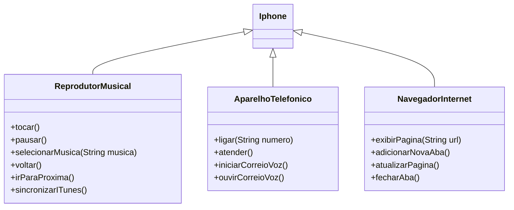

# [DIO](www.dio.me) - Trilha Java Básico

## Autores
- [Simone Cabral](https://github.com/sicabralBr)

## POO - Desafio

### Modelagem e Diagramação de um Componente iPhone

Modelagem e diagramação da representação UML do componente iPhone, produto revolucionário que possui funcionalidades inéditas como Reprodutor Musical, Aparelho Telefônico e Navegador na Internet.

#### Contexto
Diagramação das classes e interfaces

#### Funcionalidades a Modelar
1. **Reprodutor Musical**
   - Métodos: `tocar()`, `pausar()`, `selecionarMusica(String musica)`, `voltar()`, `irParaProxima()`, `sincronizarITunes()`
2. **Aparelho Telefônico**
   - Métodos: `ligar(String numero)`, `atender()`, `iniciarCorreioVoz()`, `ouvirCorreioVoz()`
3. **Navegador na Internet**
   - Métodos: `exibirPagina(String url)`, `adicionarNovaAba()`, `atualizarPagina()`, `fecharAba()`

### Objetivo
1. Criar um diagrama UML que represente as funcionalidades descritas acima.
2. Implementar as classes e interfaces correspondentes em Java (Opcional).

---
Diagrama UML
---

```` 
